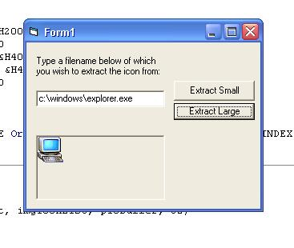



## \_ Extract an icon from any file you wish, including the root of a drive or a folder \_

### Description

You can use this code to get the icon from any file on your hard disk.... Simply call the function with a filename; 'c:\testfile.exe', an imagelist to add the icon to; 'imagelist1', a picturebox for buffer purposes; 'picturebox1' and the size of the image you wish to extract, either 16, or 32 pixels. This code returns the index of the icon that has been added to the imagelist.

tHe_cLeanER
 
### More Info
 

             |
---                |---
**Submitted On**   |2002-04-23 12:57:28
**By**             |[Jon Barker](https://github.com/Planet-Source-Code/PSCIndex/blob/master/ByAuthor/jon-barker.md)
**Level**          |Intermediate
**User Rating**    |4.6 (78 globes from 17 users)
**Compatibility**  |VB 5\.0, VB 6\.0
**Category**       |[Windows API Call/ Explanation](https://github.com/Planet-Source-Code/PSCIndex/blob/master/ByCategory/windows-api-call-explanation__1-39.md)
**World**          |[Visual Basic](https://github.com/Planet-Source-Code/PSCIndex/blob/master/ByWorld/visual-basic.md)
**Archive File**   |[\_\_Extract\_748294232002\.zip](https://github.com/Planet-Source-Code/jon-barker-extract-an-icon-from-any-file-you-wish-including-the-root-of-a-drive-or-a-folde__1-34062/archive/master.zip)

